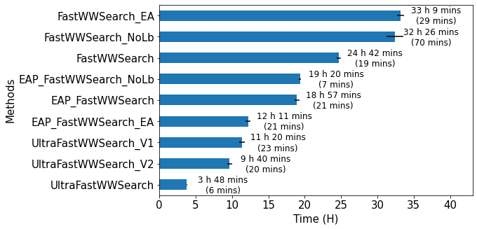
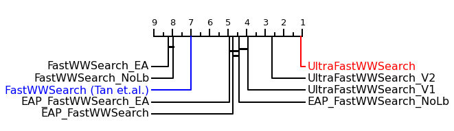
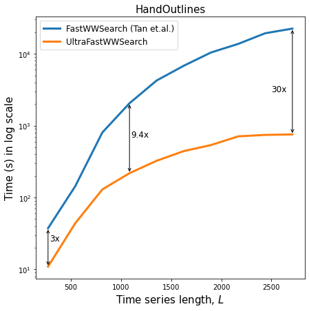
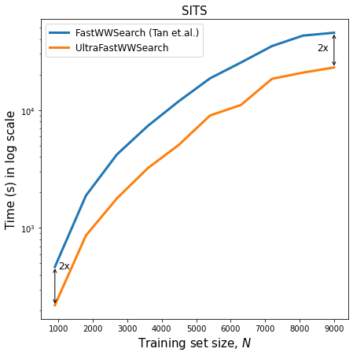

# UltraFastWWS
Ultra fast warping window optimization for Dynamic Time Warping

> <div align="justify"> The Dynamic Time Warping (DTW) similarity measure is widely used in many time series data mining applications. It computes the cost of aligning two series, smaller costs indicating more similar series. Most applications require tuning of DTW’s Warping Window (WW) parameter in order to achieve good performance. This parameter controls the amount of warping allowed, reducing pathological alignments, with the added benefit of speeding up computation. However, since DTW is in itself very costly, learning the WW is a burdensome process, requiring days even for datasets containing only a few thousand series. </div> 
> <div align="justify">In this paper, we propose ULTRAFASTWWSEARCH, a new algorithm able to learn the WW significantly faster than the state-of-the-art FASTWWSEARCH [1] method. ULTRAFASTWWSEARCH builds upon the latter, exploiting the properties of a new efficient exact DTW algorithm which supports early abandoning and pruning (EAP) [2]. We show on 128 datasets from the UCR archive that ULTRAFASTWWSEARCH is up to an order of magnitude faster than the previous state of the art.</div>

## Code
Remember to compile beforehand
```
> javac -sourcepath src -cp lib/* -d bin src/experiments/TrainingTimeBenchmark.java
> javac -sourcepath src -cp lib/* -d bin src/experiments/ScalabilityLength.java
> javac -sourcepath src -cp lib/* -d bin src/experiments/ScalabilityTrainSize.java
```

[TrainingTimeBenchmark](src/experiments/TrainingTimeBenchmark.java) file performs the benchmark experiments on various datasets.
```
> java -cp ../lib/*: experiments.TrainingTimeBenchmark -classifier=UltraFastWWSearch -problem="Trace"
```

[ScalabilityLength](src/experiments/ScalabilityLength.java) file performs the scalability experiments on long time series datasets.
```
> java -cp ../lib/*: experiments.ScalabilityLength -classifier=UltraFastWWSearch -problem="HandOutlines"
```

[ScalabilityTrainSize](src/experiments/ScalabilityTrainSize.java) file performs the scalability experiments on large time series datasets.
```
> java -cp ../lib/*: experiments.ScalabilityTrainSize -classifier=UltraFastWWSearch -problem="SITS1M_fold1"
```

### Arguments:
```
-data       : path to dataset
-out        : path to output folder
-problem    : dataset name, or a set of datasets ("all", "small")
-paramId    : parameter id for DTW warping window
-znorm      : a boolean to z-normalise the series
-classifier : classifier used 
-iter       : iteration 
-trainSize  : amount of training size, 0 indicates a range of 10 values (only applicable to ScalabilityTrainSize) 
-length     : length of time series. 0 indicates a range of 10 values (only applicable to ScalabilityLength)
-eval       : whether to do evaluation on test set
-verbose    : verbosity, 0, 1, 2
``` 

## Results
[train_time.csv](results/train_time.csv) shows the total training time for all 128 UCR datasets [3].

[best_params.csv](results/best_params.csv) shows the parameters learnt from all methods on the 128 UCR datasets [3].

The following figure shows the total training time taken for each method (excluding LOOCV) on the 128 UCR datasets [3].
<p align="center">
  
</p>

UltraFastWWSearch is significantly faster than all methods and achieves up to one order magnitude speedup than the state-of-the-art FastWWSearch [1].

<p align="center">
  
</p>


It is also scalable on large and especially long datasets, compared to FastWWSearch.

<div class="row">
  <div class="column">
    
  </div>
  <div class="column">
    
  </div>
</div> 


## References
[1] C. W. Tan, M. Herrmann, G. Forestier, G. I. Webb, and F. Petitjean,
“Efficient search of the best warping window for dynamic time warping,”
in Proc. 2018 SIAM Int. Conf. Data Mining. SIAM, 2018, pp. 225–233.

[2] M. Herrmann and G. I. Webb, “Early abandoning and pruning for elastic
distances,” arXiv preprint arXiv:2102.05221, 2021.

[3] H. A. Dau, E. Keogh, K. Kamgar, C.-C. M. Yeh, Y. Zhu, S. Gharghabi,
C. A. Ratanamahatana, Yanping, B. Hu, N. Begum, A. Bagnall,
A. Mueen, G. Batista, and Hexagon-ML, “The UCR time series classification archive,” October 2018, https://www.cs.ucr.edu/∼eamonn/time
series data 2018/.