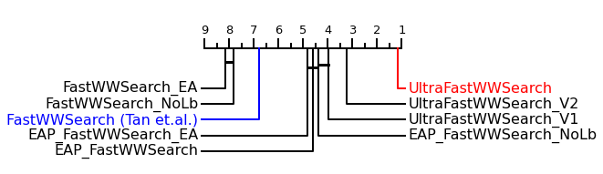

# UltraFastMPSearch
Ultra fast meta-parameter optimization for
time series similarity measures with
application to nearest neighbor classification

> <div align="justify">Nearest neighbor similarity measures are widely used in many time series data analysis applications. They compute a measure of similarity between two time series. Most applications require tuning of these measures' meta-parameters in order to achieve good performance. However, most measures have at least O(L^2) complexity, making them computationally expensive and the process of learning their meta-parameters burdensome, requiring days even for datasets containing only a few thousand series. In this paper, we propose UltraFastMPSearch, a family of algorithms to learn the meta-parameters for different types of time series distance measures. These algorithms are significantly faster than the prior state of the art. Our algorithms build upon the state of the art, exploiting the properties of a new efficient exact algorithm which supports early abandoning and pruning (EAP) for most time series distance measures. We show on 128 datasets from the UCR archive that our new family of algorithms are up to an order of magnitude faster than the previous state of the art.

1. **UltraFastWWSearch** -- recently proposed in our paper IEEE ICDM2021 [4], UltraFastWWSearch was designed specifically for DTW, exploiting
a DTW property called the window validity to gain further substantial
speedup
2. **UltraFastLocalUB** -- a variant of UltraFastWWSearch extended to
   other distance measures without the window validity. WDTW, LCSS, ERP
3. **UltraFastGlobalUB** -- a variant of UltraFastLocalUB that uses a
   global rather than local upper bound, ensuring that a distance computation
   is only early abandoned if it cannot provide a useful lower bound for distance
   computations with subsequent meta parameter values. MSM, TWE

## Code
Remember to compile beforehand
```
> javac -sourcepath src -cp lib/* -d bin src/experiments/TrainingTimeBenchmark.java
> javac -sourcepath src -cp lib/* -d bin src/experiments/ScalabilityLength.java
> javac -sourcepath src -cp lib/* -d bin src/experiments/ScalabilityTrainSize.java
```

[TrainingTimeBenchmark](src/experiments/TrainingTimeBenchmark.java) file performs the benchmark experiments on various datasets.
```
> java -cp ../lib/*: experiments.TrainingTimeBenchmark -classifier=UltraFastWWSearch -problem="Trace"
```

[ScalabilityLength](src/experiments/ScalabilityLength.java) file performs the scalability experiments on long time series datasets.
```
> java -cp ../lib/*: experiments.ScalabilityLength -classifier=UltraFastWWSearch -problem="HandOutlines"
```

[ScalabilityTrainSize](src/experiments/ScalabilityTrainSize.java) file performs the scalability experiments on large time series datasets.
```
> java -cp ../lib/*: experiments.ScalabilityTrainSize -classifier=UltraFastWWSearch -problem="SITS1M_fold1"
```

### Arguments:
```
-data       : path to dataset
-out        : path to output folder
-problem    : dataset name, or a set of datasets ("all", "small")
-paramId    : parameter id for DTW warping window
-znorm      : a boolean to z-normalise the series
-classifier : classifier used 
-iter       : iteration 
-trainSize  : amount of training size, 0 indicates a range of 10 values (only applicable to ScalabilityTrainSize) 
-length     : length of time series. 0 indicates a range of 10 values (only applicable to ScalabilityLength)
-eval       : whether to do evaluation on test set
-verbose    : verbosity, 0, 1, 2
``` 

## Results
[train_time.csv](results/train_time.csv) shows the total training time for all 128 UCR datasets [3].

[best_params.csv](results/best_params.csv) shows the parameters learnt from all methods on the 128 UCR datasets [3].

The following figure shows the total training time taken for each method (excluding LOOCV) on the 128 UCR datasets [3].
<p align="center">
  
</p>

UltraFastWWSearch is significantly faster than all methods and achieves up to one order magnitude speedup than the state-of-the-art FastWWSearch [1].

<p align="center">
  
</p>


It is also scalable on large and especially long datasets, compared to FastWWSearch.

<p align="center">
  
</p>
<p align="center">
  
</p>


## References
[1] C. W. Tan, M. Herrmann, G. Forestier, G. I. Webb, and F. Petitjean,
“Efficient search of the best warping window for dynamic time warping,”
in Proc. 2018 SIAM Int. Conf. Data Mining. SIAM, 2018, pp. 225–233.

[2] M. Herrmann and G. I. Webb, “Early abandoning and pruning for elastic
distances,” arXiv preprint arXiv:2102.05221, 2021.

[3] H. A. Dau, E. Keogh, K. Kamgar, C.-C. M. Yeh, Y. Zhu, S. Gharghabi,
C. A. Ratanamahatana, Yanping, B. Hu, N. Begum, A. Bagnall,
A. Mueen, G. Batista, and Hexagon-ML, “The UCR time series classification archive,” October 2018, https://www.cs.ucr.edu/∼eamonn/time
series data 2018/.

[4] C. W. Tan, M. Herrmann, and G. I. Webb,
“Ultra fast warping window optimization for Dynamic Time Warping,”
in Proc. 2021 IEEE Int. Conf. Data Mining. IEEE, 2021, pp. 589–598.